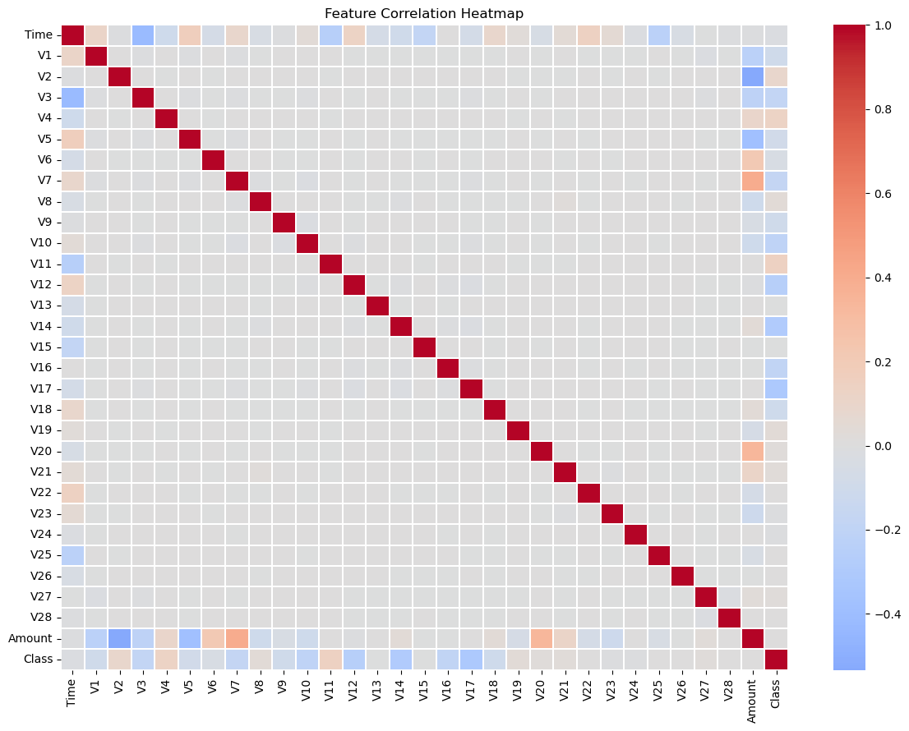
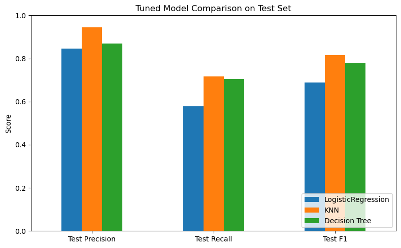

# Credit Card Fraud Detection

A machine learning project that detects fraudulent credit card transactions using classification models trained on a highly imbalanced dataset.

## Overview

This project trains and compares three classification models — Logistic Regression, K-Nearest Neighbors, and Decision Tree — to detect fraudulent transactions. The dataset contains transactions made by European cardholders, where only ~0.17% of transactions are fraudulent, making this a heavily imbalanced classification problem.

Because of the imbalance, **Accuracy is not a useful metric here** — a model predicting "legitimate" for everything would still score above 99%. This project instead prioritizes **Recall, Precision, and F1-score**, since the real-world cost of missing a fraud case (False Negative) is typically much higher than the cost of a false alarm (False Positive).

## Dataset

- Source: [Credit Card Fraud Detection — Kaggle](https://www.kaggle.com/datasets/mlg-ulb/creditcardfraud)
- 284,807 transactions, 31 features (`Time`, `V1`-`V28` PCA-transformed features, `Amount`, `Class`)
- Target: `Class` — 0 = legitimate, 1 = fraud

The dataset is not included in this repo due to size. Download it from Kaggle and place it at `data/creditcard.csv`.

## Methodology

1. **EDA & Data Quality** — duplicate removal, null checks, class imbalance analysis
2. **Train/Test Split** — stratified 80/20 split to preserve class ratio
3. **Model Training** — Logistic Regression, KNN, and Decision Tree, each evaluated with 5-Fold Stratified Cross-Validation
4. **Hyperparameter Tuning** — `GridSearchCV` per model, optimizing for F1-score:
   - Logistic Regression: `C` ∈ {0.01, 0.1, 1, 10, 100}
   - KNN: `n_neighbors` ∈ {1, 3, 5, 7, 11, 15, 19}
   - Decision Tree: `max_depth` ∈ {2, 3, 5, 7, 10, None}
5. **Model Comparison & Selection** — comparing tuned models on the held-out test set

## Results

| Model | Best Params | CV F1 | Test Precision | Test Recall | Test F1 |
|---|---|---:|---:|---:|---:|
| Logistic Regression | C=1 | 0.710 | 0.86 | 0.61 | 0.71 |
| **KNN (selected)** | **k=3** | **0.848** | **0.94** | **0.72** | **0.81** |
| Decision Tree | max_depth=5 | 0.831 | 0.88 | 0.71 | 0.78 |

### Final Model: KNN (k=3, scaled)

Selected because it achieved the highest CV F1-score and the highest test-set Precision among all three tuned models, with strong Recall. Logistic Regression was ruled out due to meaningfully lower Recall — missing more actual fraud cases, which is the costlier error type in this business context.

## Why Cross-Validation (not a single train/test split) Decided the Best Model

Two separate experiments were run in this project:

1. **Hyperparameter exploration (single split):** used to observe how each model's behavior changes with different hyperparameter values (e.g. KNN's `k`, Decision Tree's `max_depth`). A single split alone isn't reliable enough to declare a winner, since results can shift depending on which rows land in the test set.
2. **GridSearchCV with 5-Fold Stratified CV:** used to actually select the final model. Each model family was tuned on its own hyperparameter grid, optimizing F1-score, giving every model a fair shot at its own best setting before comparing across model types.

## Project Structure

fraud detection project/
│
├── data/
│   └── creditcard.csv          # Raw transaction dataset
├── models/
│   ├── model.pkl               # Saved trained Logistic Regression model
│   └── scaler.pkl              # Saved StandardScaler object
├── reports/
│   ├── logistic_cm.png         # Logistic regression confusion matrix
│   ├── Scaled_knn_cm_k5.png    # KNN evaluation plot
│   └── tree_cm_depth_5.png     # Decision Tree evaluation plot
├── src/
│   ├── data_prep.py            # Data loading & cleaning pipeline
│   ├── train.py                # Model training, CV, & artifact export
│   └── predict.py              # Inference script for new samples
├── .gitignore
├── requirements.txt
└── README.md

## Possible Improvements

- Tune hyperparameters inside cross-validation for all metrics simultaneously (multi-metric GridSearchCV) rather than optimizing F1 alone
- Deploy `predict.py` behind a lightweight API (e.g. FastAPI) for real-time scoring

### Catastrophic Impact of Unscaled Features:

When features are not scaled, high-magnitude variables (Amount and Time) dominate the Euclidean distance calculations. Consequently, as K increases from 1 to 20 without scaling, Recall drops drastically from 14.74% down to 0.00%. At K=20, the model fails to detect a single fraudulent transaction because minority class instances are completely overwhelmed by nearest neighbors from the majority class.

### Performance Recovery via Feature Scaling:

Applying StandardScaler standardizes all features to zero mean and unit variance. This leads to a massive improvement across all metrics:

F1-Score Boost: F1-score increases from 0.0412 to 0.7975 at K=5.

Recall Improvements: Recall jumps from 2.11% to 68.42% for K=5.

## Why Cross-Validation (not the single train/test split) Decided the Best Model

Two separate experiments were run during this project, and they serve different purposes:

1. Hyperparameter exploration (single train/test split): KNN was tested with 
   k = 1, 5, 20, and Decision Tree was tested with max_depth = None, 2, 5, 10. 
   These experiments were used to understand each model's behavior — whether 
   it overfits or underfits as the hyperparameter changes — not to pick a final 
   model. A single split can be misleading on its own, since the result depends 
   partly on which rows happened to land in the test set.

2. Model comparison (5-Fold Stratified Cross-Validation): To choose between 
   Logistic Regression, KNN, and Decision Tree, 5-fold CV was used because it 
   averages performance across 5 different train/test splits, giving a much 
   more reliable estimate than a single split.

